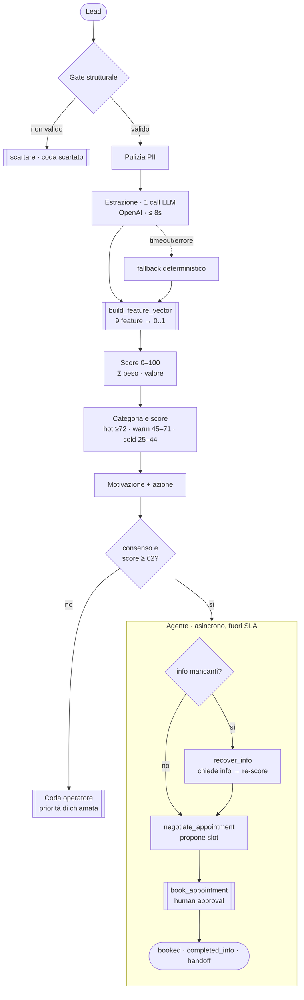

# Flusso di valutazione e funzionamento dell'LLM

## Il flusso in breve

Lo score path è deterministico, con **una sola call LLM**. Ogni stadio è isolato: se qualcosa fallisce c'è graceful handling. 



Gli stadi, nell'ordine (`src/pipeline/pipeline.py`):

1. **lead_id + cache** — id stabile (dal `lead_id`, altrimenti da phone/email/data); i
   duplicati escono subito dalla cache di idempotenza.
2. **Gate** (`src/gate/validity.py`) — validazione **strutturale, senza LLM**: un lead è
   `invalid` se non ha un canale di contatto raggiungibile, oppure se il telefono è
   palesemente fasullo o l'email è usa-e-getta (blocklist). Conservativo: un
   falso-invalid è l'errore più costoso.
3. **Personalizzazione** (`src/history.py`) — match esatto sullo storico per dedup /
   cliente di ritorno. Non entra nello score.
4. **Estrazione** (`src/extraction/`) — la **sola call LLM**, su messaggio redatto.
5. **Feature vector + score** (`src/scoring/`) — `build_feature_vector` normalizza 9
   feature in `[0,1]`, lo scorer fa il prodotto scalare con i pesi.
6. **Categoria** (`src/categorization/bands.py`) — bande sullo score, con override
   `invalid` da gate / `looks_invalid`.
7. **Motivazione** (`src/motivation/`) — stringa **deterministica**, nessuna seconda
   call LLM.
8. **Azione + trigger agente** (`src/action/decision.py`).

## L'LLM: una call, solo estrazione

L'unico punto in cui si tocca un LLM nello scoring è `LLMAdapter.extract`
(`src/extraction/llm.py`). Legge il **messaggio pulito da pii** più una whitelist
di campi non-PII di contesto (`channel`, `platform`, `campaign`, `vehicle_interest`,
`city`, `zip_prefix` a 3 cifre) e restituisce `ExtractedFeatures`. Parametri: modello
`gpt-5.4-mini`, `temperature=0`, **JSON schema**, timeout **8s**.

**Privacy prima della call**: `redact_message` tokenizza telefono/email/nome in
`[PHONE] [EMAIL] [NAME]`, `assert_no_raw_pii` controlla che solo i campi whitelist
lascino il processo. Nessun PII grezzo raggiunge il provider.

I 14 campi estratti e a cosa servono:

| Campo | Uso |
|---|---|
| `intent_strength`, `budget_present`, `vehicle_specificity`, `trade_in_present`, `availability_mentioned`, `sentiment` | **entrano nello score** (feature semantiche) |
| `missing_critical_fields` (`budget` / `timeline_acquisto` / `modello`) | routing: se non vuoto → azione `chiedere_info` / goal `recover_info` |
| `looks_invalid` | override → categoria `invalid` |
| `budget_value_eur`, `trade_in_vehicle`, `urgency_signals` | contesto per l'agente (permuta, finanziamento, urgenza) |
| `rationale_signals` | frase mostrata all'operatore nella motivazione |
| `extraction_confidence` | confidenza; sotto soglia → `low_confidence` |

## Le variabili dello score

`build_feature_vector` (`src/scoring/feature_vector.py`) produce **9 feature** — 6
semantiche dall'LLM, 3 strutturali deterministiche — ciascuna normalizzata in `[0,1]`.
Lo score è la loro combinazione lineare con i **pesi naive**
(`config/score_weights_naive.json`, somma 100):

| Feature | Fonte | Significato | Valori normalizzati | Peso |
|---|---|---|---|---:|
| `intent_strength` | LLM | intento d'acquisto | low 0.2 · medium 0.6 · high 1.0 | **24** |
| `budget_present` | LLM | budget dichiarato | no 0 · sì 1 | **18** |
| `vehicle_specificity` | LLM | modello preciso vs categoria | none 0 · generic 0.5 · specific 1.0 | **15** |
| `availability` | LLM | disponibilità a call / test drive | no 0 · sì 1 | **12** |
| `trade_in_present` | LLM | permuta menzionata | no 0 · sì 1 | **9** |
| `reachability` | strutturale | qualità del contatto | cellulare 1.0 · fisso o email 0.6 · nessuno 0 | **8** |
| `geo_match` | strutturale | area di competenza (ZIP/città) | in area 1.0 · limitrofa 0.5 · lontana 0.1 · ignota 0.3 | **6** |
| `recency` | strutturale | freschezza del lead | 1.0 a 0 gg → 0 a ≥30 gg (0.5 se data ignota) | **5** |
| `sentiment` | LLM | tono del messaggio | negative 0 · neutral 0.5 · positive 1.0 | **3** |

Formula (`src/scoring/scorer.py`):

```
score = round( Σ  peso_f · valore_f ),  vincolato a [0, 100]
```

I **contributi per-feature** (`peso·valore`) restano esposti nell'output, quindi ogni
score è verificabile: si legge da cosa è composto, non è una black-box. La stessa
`build_feature_vector` è pensata per essere riusata **identica** dal training offline
sui dati storici — così i pesi appresi valgono sul medesimo vettore che gira a runtime,
senza skew (vedi `calibrazione_pesi.md`).

## Perché score e categoria sono strettamente legati

Lo score **non è un numero arbitrario**: è la somma pesata proprio delle variabili che
indicano il **valore** del lead (intento, budget, specificità del modello, disponibilità,
permuta, raggiungibilità, area, freschezza, tono). Ogni variabile è orientata nello
stesso verso — "più alto = lead più qualificabile" — quindi lo score 0–100 è un **proxy
monotòno della bontà del lead**.

Da qui nasce la categoria: **è solo una label dei range di score**.

| Categoria | Fascia score | Lettura |
|---|---|---|
| `hot` | ≥ 72 | intento forte + budget/modello: auto-gestibile |
| `warm` | 45–71 | qualificabile, ma va chiamato |
| `cold` | 25–44 | debole / sta solo guardando |
| `invalid` | — | **non è una fascia**: viene dal gate o da `looks_invalid`; score forzato a 0 |

Le soglie stanno in `config/category_thresholds.json` (`hot 72, warm 45, cold 25`).
Poiché lo score codifica già il valore, definire le categorie come **range** è naturale:
sono tagli percentili sull'asse del valore, non un secondo giudizio indipendente. Ed è
lo stesso approccio a guidare anche l'**automazione**: `warm_high = 62` è un secondo taglio
dentro `warm`, la **soglia unica** con cui parte l'agente (con consenso e `score ≥ 62`;
gli `hot` sono sempre sopra). Un solo numero, quindi, decide se automatizzare.

I valori attuali sono **naive/hand-tuned**: scelti perché separino in modo sensato
auto-gestibili / da chiamare / deboli, ma **ricalibrabili** sul tasso di conversione
reale dello storico senza toccare il codice.

## L'agente e i suoi tool (mock)

Sui lead di valore con consenso, parte il **Lead-Resolution Agent**
(`src/agent/`): una state machine guidata da un planner (LLM `gpt-5.4` con fallback a planner deterministico). Ogni azione passa da `enforce()` — *"l'LLM propone, il codice
deterministico controlla"*. I
tool sono tutti mock deterministici (nessuna chiamata esterna; destinatari sempre come
token opachi, mai PII).

> **Campo `consent` (aggiunto).** Non è nello schema lead originale della consegna:
> introdotto per il **GDPR**. Indica il consenso del cliente a essere
> contattato in automatico ed è il gate di ogni azione in uscita dell'agente. **Se
> assente vale "no"**: l'unica condizione che abilita è `consent is True`
> (`src/action/decision.py`), quindi senza consenso esplicito il lead va all'operatore
> e l'agente non invia nulla. È anche il motivo per cui il consenso è valutato *a monte*
> del trigger, non a metà conversazione.

| Tool | Cosa fa (mock) | Diritto |
|---|---|---|
| `re_extract` | ri-analizza la risposta del cliente per le `ExtractedFeatures` | auto |
| `check_inventory` | verifica disponibilità a stock del veicolo | auto |
| `recommend_alternatives` | propone modelli equivalenti in area se out-of-stock | auto |
| `check_availability` | elenca slot per il test drive | auto |
| `estimate_trade_in` | range indicativo di permuta | auto |
| `simulate_financing` | rata mensile | auto |
| `request_missing_info` | chiede i campi mancanti → `AWAITING_USER_REPLY` | auto + consenso |
| `propose_slots` | propone gli slot → `AWAITING_CONFIRMATION` | auto + consenso |
| `send_message` | invia messaggio templato (whatsapp/sms/email) | auto + consenso |
| `send_asset` | invia scheda veicolo / listino / link configuratore | auto + consenso |
| `book_appointment` | prenota lo slot | **human approval** (staged) |
| `warm_transfer_to_operator` | passa il lead a un umano con contesto | auto |
| `escalate_to_human` | passa a un umano in caso di errore | auto |

Due goal: **`recover_info`** (mancano campi → l'agente li recupera, **ri-calcola lo
score** off-SLA con `merge_features` e, se il lead diventa booking-worthy, negozia) e
**`negotiate_appointment`** (lead completo → propone slot e prenota). La **prenotazione è
sempre staged**: `PENDING_APPROVAL` → evento `HUMAN_APPROVAL` → `BOOKED`. L'agente non
squalifica mai per qualità: solo il gate può farlo.
